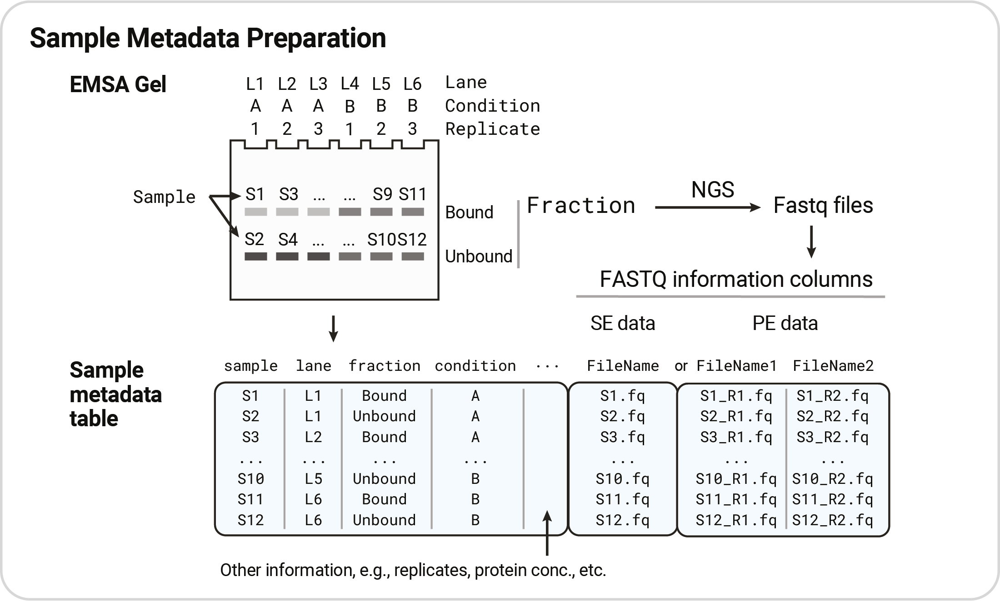
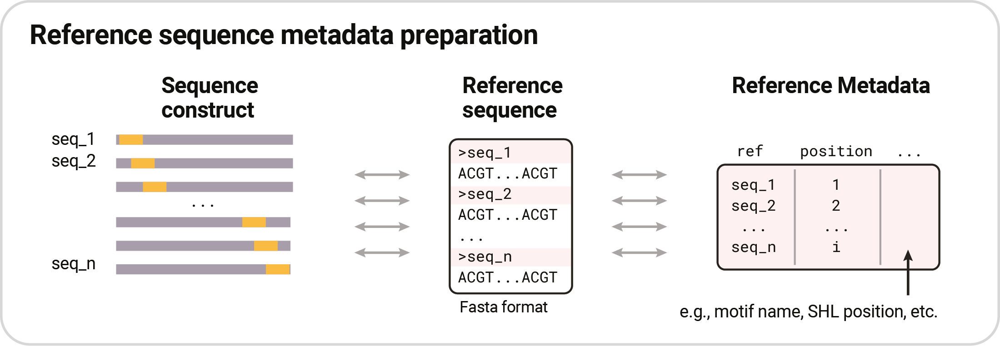
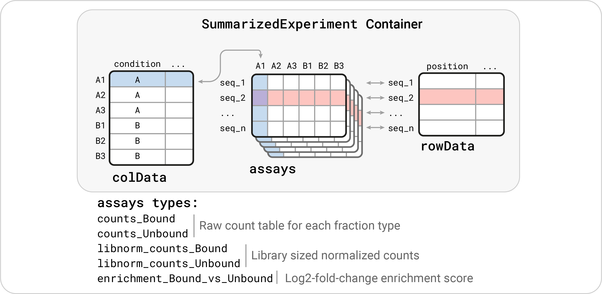
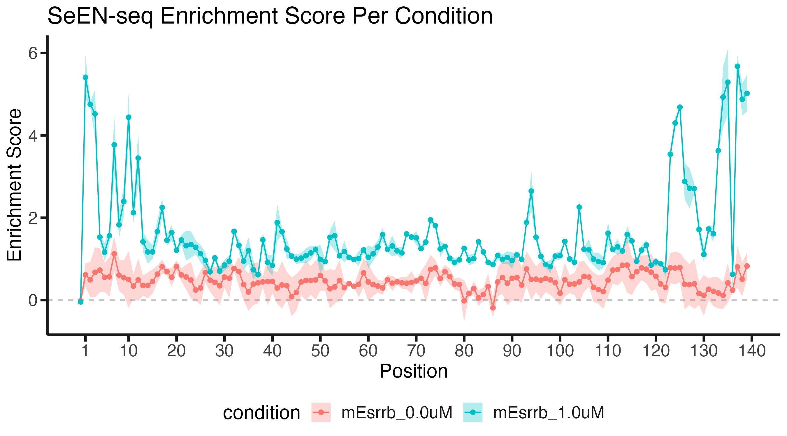

# SeEN-seq Analysis Pipeline
This repositoray contains R scripts for running the analysis of **Se**lected **E**ngagement on **N**ucleosome **seq**uencing (**SeEN-seq**) datasets.

***

## Input preparation

### 0) Fastq files

In SeEN-seq analysis, each fastq file is assumed to derive from the band of the Electrophoretic Mobility Shift Assay (EMSA) gel in which the SeEN-seq experiment is conducted. For the schematic used in this repository, the sample name is referred to as `S<ID>`, e.g., S1, S2, ... However, you can use other name that suit your need in the real analysis of you data.

### 1) Sample Information

The sample metadata records the information of each sample (gel band) that could be important for the downstream analysis. For example, condition, replicate, protein concentration, etc. 

As we will use read alignment and count by the R package (QuasR), a separate input table noting where the fastq file can be found is needed. The information for each type of input tables can be found below:

#### 1.1 Sample table for `SummarizedExperiment` object

This notes information for each sample (i.e., bands). The sample metadata table can contain these columns:

##### Mandatory columns

+ __sample__: The sample ID correspinding to each set of fastq input. This should not contain duplicated values between row as it should describe each band of your EMSA gel.
+ __group__: The ID for each EMSA lane. This will later be used as the column name of the output `SummarizedExperiment` object.
+ __fraction__: A fraction type from the EMSA gel in which your band located in. A typical fraction for SeEN-seq could be a simple "*Bound*" and "*Unbound*". However, it is possible to have more than two types of fractions in SeEN-seq experiment. For example, some transcription factor may show multiple bound fraction in the gel.
  + Raw reads counts will be split between each fraction type in the final `SummarizedExperiment` output.
+ __condition__: General annotation of the condition used in the experiment. This is mainly used for final plotting.

##### Recommended columns

* __fastq_prefix__: prefix for fastq searching. This feature will be introduced in the future versions to skip manual construction of QuasR input table.

__*NOTE*__: 
With exception of the *sample* column, other columns in sample table can contain duplicated values. However, when assembing `SummarizedExperiment`, the *sample* and *fraction* (and possibly *fastq_prefix*) columns will be removed. Rows with completely redundant information will be removed to create a __group metadata table__. In this case, the *group* column is required to contain unique information.

#### 1.2 Sample table input for running `QuasR`

The QuasR package strictly requires input table with certain column names, number, and order. This is depends on the layout of your SeEN-seq dataset. Here is a description of how the input should be formatted:

##### Single-end input data
+ __FileName__: Path (preferably absolute) to each fastq file.
+ __SampleName__: Exactly the same as the __sample__ column of your sample metadata table

##### Paired-end input data
+ __FileName1__: Path (preferably absolute) to each R1 fastq file.
+ __FileName2__: Path (preferably absolute) to each R2 fastq file.
+ __SampleName__: Same as in single end data

### 2) Reference Sequence Information

The reference data should correspond to the construct sequences used in your SeEN-seq experiment. From the figure below, two types in inputs are needed -- (i) Fasta file for reference sequence, and (ii) Table for sequence metadata.

#### 2.1 Fasta file

Normal fasta file of the sequence construct used in your SeEN-seq experiment.

#### 2.2 Reference metadata table

A table recording information for sequence constructs. These columns are required for the input specific to scrips used in this pipeline:

+ __ref__: Name of the reference sequence. This must correspond to the sequence names used in fasta input file.
+ __position__: Noting motif position. This will be used when plotting enrichment score.

***

## 3) The outputs

### 3.1 `SummarizedExperiment` Object

The group metadata (originated from sample table), reference table, and count tables (separated by fraction types) are gathered together in the `SummarizedExperiment` container object (more information [here](https://bioconductor.org/packages/release/bioc/html/SummarizedExperiment.html)). This helps ensure that the rows and columns of count and enrichment table (assays) are properly tied to reference metadata (rowData) and group metadata (colData), respectively.

### 3.2 Enrichment Plots

Nucleosome binding preference of transcription factor can be shown as enrichment score - that is a log2 fold change of the signal between the two fractions (e.g., log2(bound/unbound)).

***

<!-- ## Pipeline Overview

Below is the overview of the SeEN-seq analysis steps described in this pipeline:

*** -->

## Reference
The analysis of SeEN-seq was originally described in:

Michael, Alicia K., Ralph S. Grand, Luke Isbel, Simone Cavadini, Zuzanna Kozicka, Georg Kempf, Richard D. Bunker et al. "Mechanisms of OCT4-SOX2 motif readout on nucleosomes." _Science_ __368__, no. 6498 (2020): 1460-1465.

Kobayashi, Wataru, Anna H. Sappler, Daniel Bollschweiler, Maximilian Kümmecke, Jérôme Basquin, Eda Nur Arslantas, Siwat Ruangroengkulrith, Renate Hornberger, Karl Duderstadt, and Kikuë Tachibana. "Nucleosome-bound NR5A2 structure reveals pioneer factor mechanism by DNA minor groove anchor competition." _Nature structural & molecular biology_ __31__, no. 5 (2024): 757-766.

