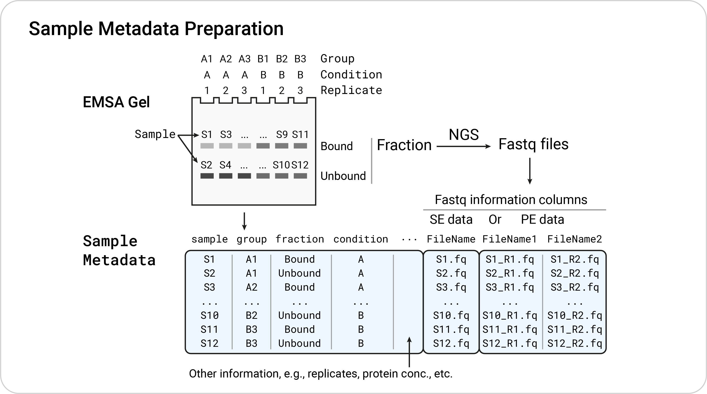
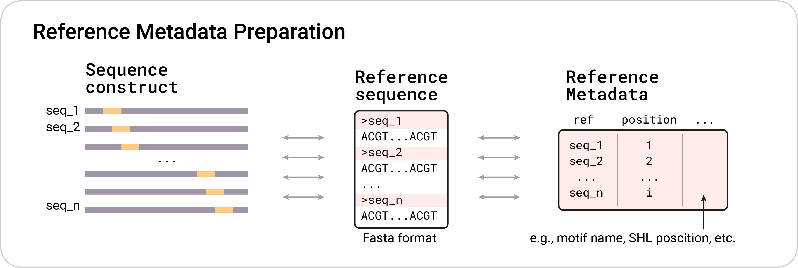

# SeEN-seq Analysis Pipeline
This repositoray contains R scripts for running the analysis of **Se**lected **E**ngagement on **N**ucleosome **seq**uencing (**SeEN-seq**) datasets.

## Quick Start:

+ Recommended environment definition for SeEN-seq analysis can be found in [env/SeEN_seq_environment.yaml](env/SeEN_seq_environment.yaml)
+ Example input files can be found in the [example](example) folder.
+ Quick environment and test run set up can be found at [STAR_Protocol/0_setup.sh](STAR_Protocol/0_setup.sh).
+ The SeEN-seq analysis script used as the template for code block in the STAR Protocol paper can be found at [STAR_Protocol/STAR_protocol_SeEN_seq_analysis.R](STAR_Protocol/STAR_protocol_SeEN_seq_analysis.R)

***

## Step I: Input preparation

### 0) Fastq files

In SeEN-seq analysis, each fastq file is assumed to derive from the band (_i.e._, bound and unbound fractions) of the Electrophoretic Mobility Shift Assay (EMSA) gel in which the SeEN-seq experiment is conducted. For the schematic used in this repository, the sample name is referred to as `S<ID>`, e.g., S1, S2, ... However, you can use other name that suit your need in the real analysis of you data.

For demonstration purpose, the example data has been deposited in sequence read archive (SRA) under accession PRJNA1305216. A full list of SRA Run ID can be found at [example/PRJNA1305216_SraAccList.txt](example/PRJNA1305216_SraAccList.txt)

### 1) Sample Information

The example input table compatible with our workflow can be found at [example/sample_metadata_PE.tsv](example/sample_metadata_PE.tsv) of this repository. The sample metadata records the information of each sample (gel band) that could be important for the downstream analysis. For example, condition, replicate, protein concentration, etc.

As we will use read alignment and count by the R package (QuasR), the column(s) indicating where the fastq file can be found for each sample are expected.

#### 1.1 Required and recommended sample table columns

##### Mandatory columns

+ __sample__: The sample ID correspinding to each set of fastq input. This should not contain duplicated values between row as it should describe each band of your EMSA gel. 
  + Note that this column will be changed to _SampleName_ in the table used for read alignment by QuasR.
+ __lane__: The ID for each EMSA lane. This will later be used as the column name of the output `SummarizedExperiment` object.
+ __fraction__: A fraction type from the EMSA gel in which your band located in. A typical fraction for SeEN-seq could be a simple "*Bound*" and "*Unbound*". However, it is possible to have more than two types of fractions in SeEN-seq experiment. For example, some transcription factor may show multiple bound fraction in the gel.
  + Raw reads counts will be split between each fraction type in the final `SummarizedExperiment` output.
+ __condition__: General annotation of the condition used in the experiment. This is mainly used for final plotting.

##### Columns for QuasR package

Depending on the layout of your datasets, the following columns are required:

+ Single-end dataset:
  + __FileName__: A path to fastq file of each sample.
+ Paired-end dataset:
  + __FileName1__, __FileName2__: Paths to read 1 and 2 of paired-end dataset

__*NOTE*__: 
With the exception of the *sample* column, other columns in sample table can contain duplicated values. However, the `SummarizedExperiment` of SeEN-seq data is assembling based on the _lane_ information. The lane metadata is made from unique rows after the *sample* and *fraction* columns are removed. Please make sure that the lane metadata doesn't contain duplicated value in the lane column.

<!--
#### 1.2 Sample table input for running `QuasR`

The QuasR package strictly requires input table with certain column names, number, and order. This is depends on the layout of your SeEN-seq dataset. Here is a description of how the input should be formatted:

##### Single-end input data
+ __FileName__: Path (preferably absolute) to each fastq file.
+ __SampleName__: Exactly the same as the __sample__ column of your sample metadata table

##### Paired-end input data
+ __FileName1__: Path (preferably absolute) to each R1 fastq file.
+ __FileName2__: Path (preferably absolute) to each R2 fastq file.
+ __SampleName__: Same as in single end data 
-->

### 2) Reference Sequence Information

The reference data should correspond to the construct sequences used in your SeEN-seq experiment. From the figure below, two types in inputs are needed 

+ FASTA file for reference sequence. 
+ Table for sequence metadata. 

#### 2.1 Fasta file

Normal fasta file of the sequence construct used in your SeEN-seq experiment. See example at [example/ref_sequence.fasta](example/ref_sequence.fasta)

#### 2.2 Reference metadata table

A table recording information for sequence constructs. See example in [example/ref_metadata.tsv](example/ref_metadata.tsv). These columns are required for the input specific to scrips used in this pipeline:

+ __ref_name__: Name of the reference sequence. This must correspond to the sequence names used in fasta input file.
+ __position__: Noting motif position. This will be used when plotting enrichment score.

***

## Step II: Run The Analysis

A step-by-step analysis of SeEN-seq datasets as specified in the STAR Protocol paper can be found at [STAR_Protocol/STAR_protocol_SeEN_seq_analysis.R](STAR_Protocol/STAR_protocol_SeEN_seq_analysis.R). This shouldn't be depending on any other scripts. A wrapper functions might be added to this repository in the future.

***

## The outputs

### `SummarizedExperiment` Object

The lane metadata (originated from sample table), reference table, and count tables (separated by fraction types) are gathered together in the `SummarizedExperiment` container object (more information [here](https://bioconductor.org/packages/release/bioc/html/SummarizedExperiment.html)). This helps ensure that the rows and columns of count and enrichment table (assays) are properly tied to reference metadata (rowData) and lane metadata (colData), respectively.

### Basic QC

One basic quality control for SeEN-seq analysis is to check whether constructs originated from motif insertion at certain positions are over- or under-represented or not. This could be explained by multiple reason. For example, (i) some constructs have intended or unintended higher concentration than the other, or (ii), insertion of motif at certain position produce restriction site for restriction enzyme used in the experiment, etc. The basic QC plot should help us spotting these issues.

### Enrichment Plots

Nucleosome binding preference of transcription factor can be shown as enrichment score - that is a log2 fold change of the signal between the two fractions (e.g., log2(bound/unbound)).

***

<!-- ## Pipeline Overview

Below is the overview of the SeEN-seq analysis steps described in this pipeline:

*** -->

## Key Repo Versions

+ **[Release v0.1.0](https://github.com/TotipotencyLab/SeEN_seq/releases/tag/v0.1.0)**: The exact version used for submission to STAR Protocol.

***

## Reference
The SeEN-seq assay was originally described in:

+ Michael, Alicia K., Ralph S. Grand, Luke Isbel, Simone Cavadini, Zuzanna Kozicka, Georg Kempf, Richard D. Bunker et al. "Mechanisms of OCT4-SOX2 motif readout on nucleosomes." _Science_ __368__, no. 6498 (2020): 1460-1465.

<!-- Kobayashi, Wataru, Anna H. Sappler, Daniel Bollschweiler, Maximilian Kümmecke, Jérôme Basquin, Eda Nur Arslantas, Siwat Ruangroengkulrith, Renate Hornberger, Karl Duderstadt, and Kikuë Tachibana. "Nucleosome-bound NR5A2 structure reveals pioneer factor mechanism by DNA minor groove anchor competition." _Nature structural & molecular biology_ __31__, no. 5 (2024): 757-766. -->

